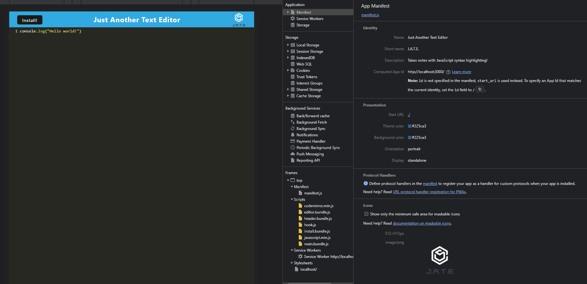

# Progressive Web Applications: Text Editor

## Description
This single-page app is a text editor that runs in the web browser. It meets the PWA criteria and features a number of data persistence techniques that serve as redundancy in case one of the options is not supported by the browser. The app functions offline, utilizes IndexedDB, and is deployed using Heroku.

## Installation
1. Download source code and open the Develop folder in your terminal.
2. In the command line, run: ```md npm i ``` to install node modules.
3. Run ```md npm run start ``` to open the text editor.

## Images




## Heroku Link
https://pwa-text-editor-050923.herokuapp.com/

## Contributions
Thank you to my classmate Rebecca (https://github.com/rebeccalehew) for showing me how to create a proper manifest file for this project.